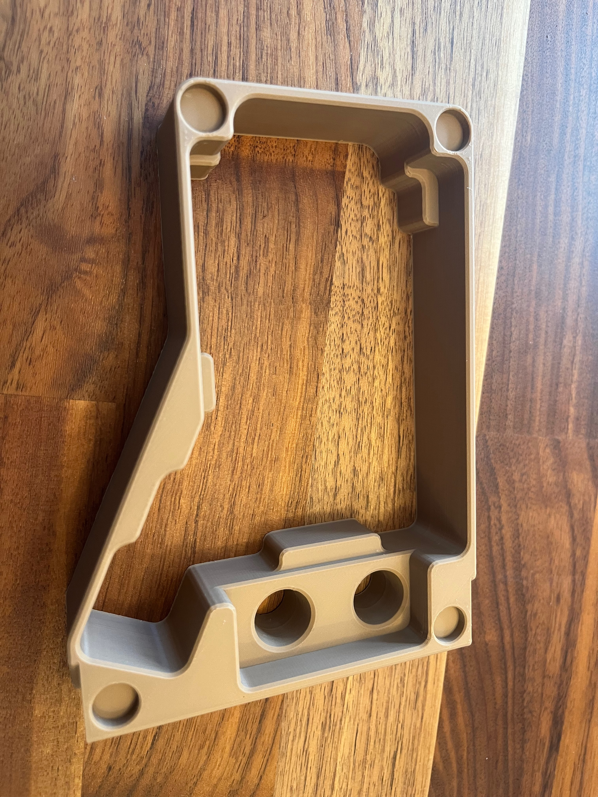
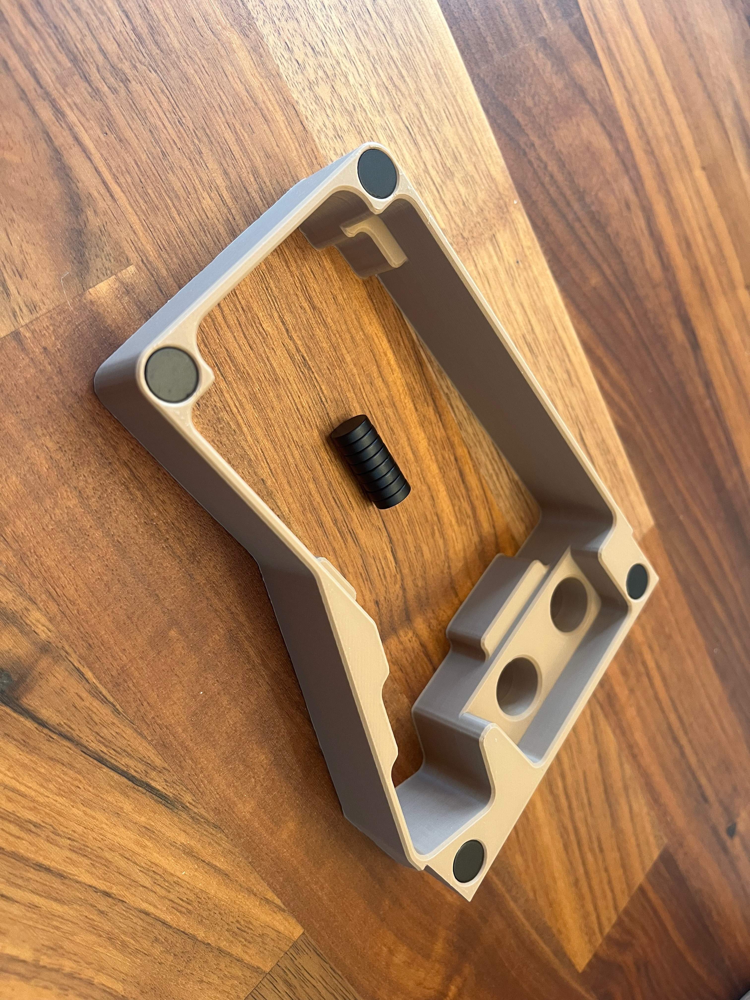
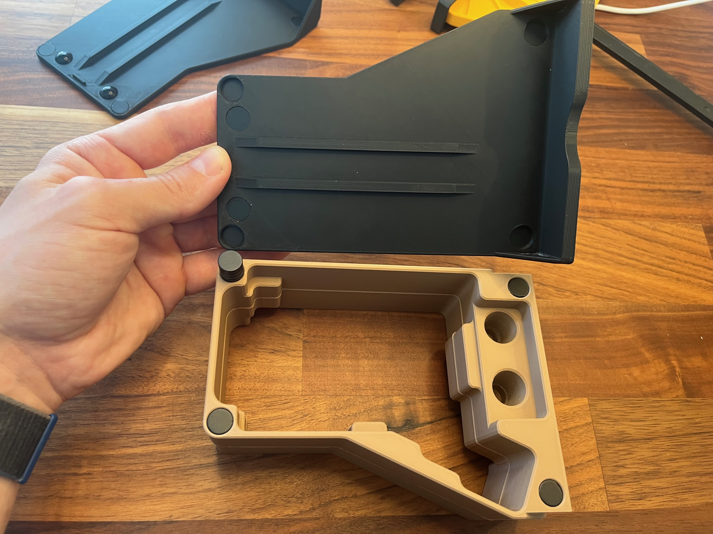
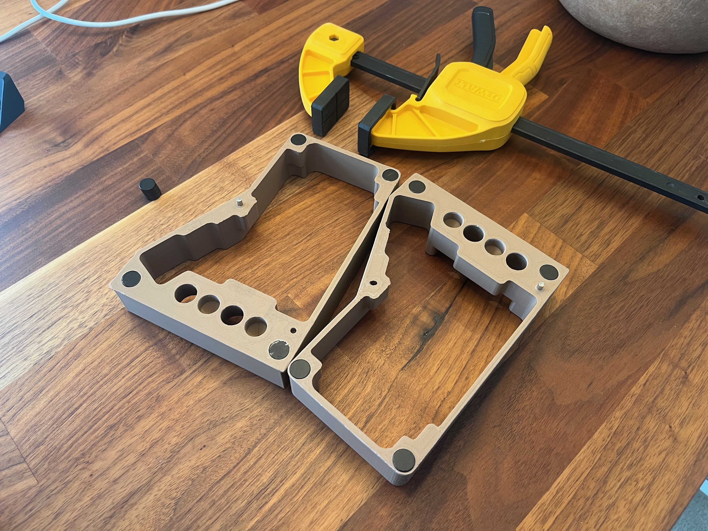
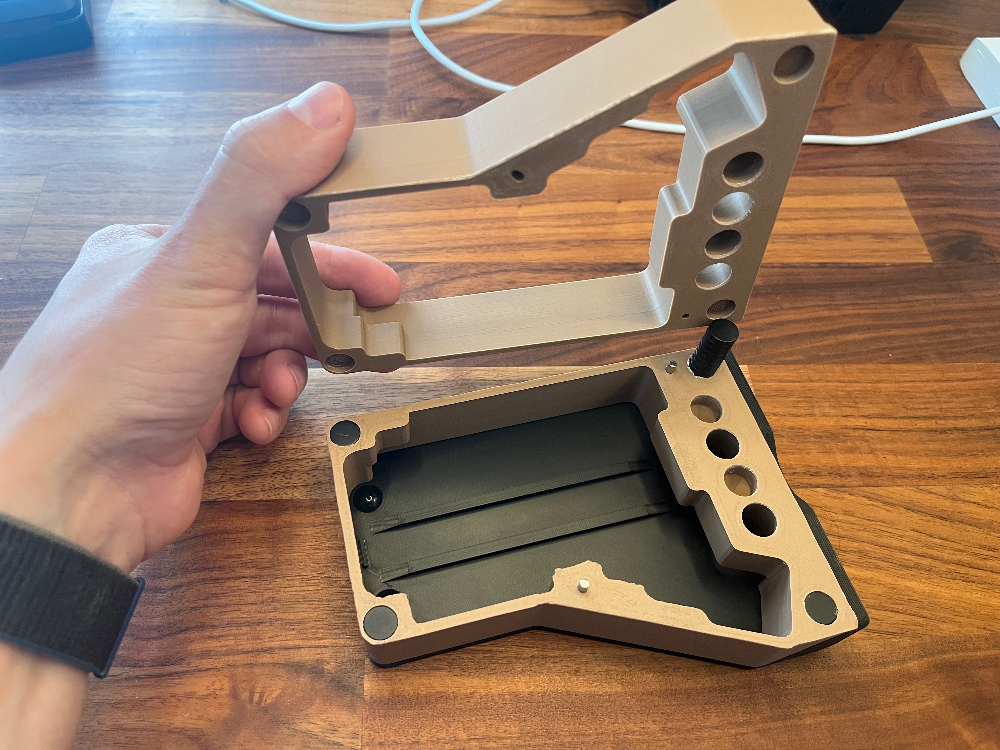
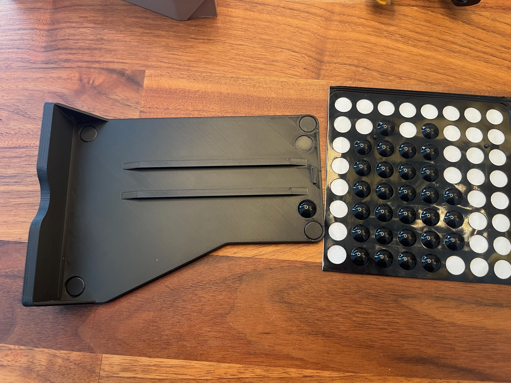
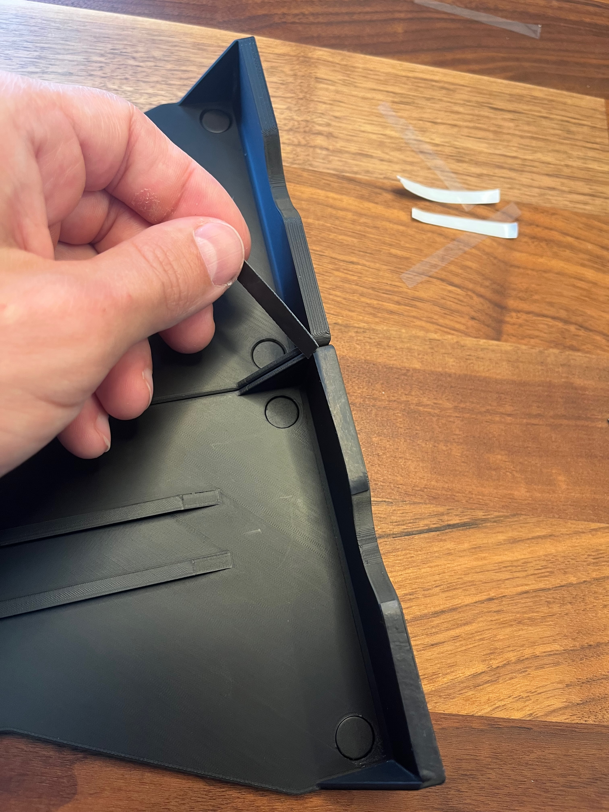
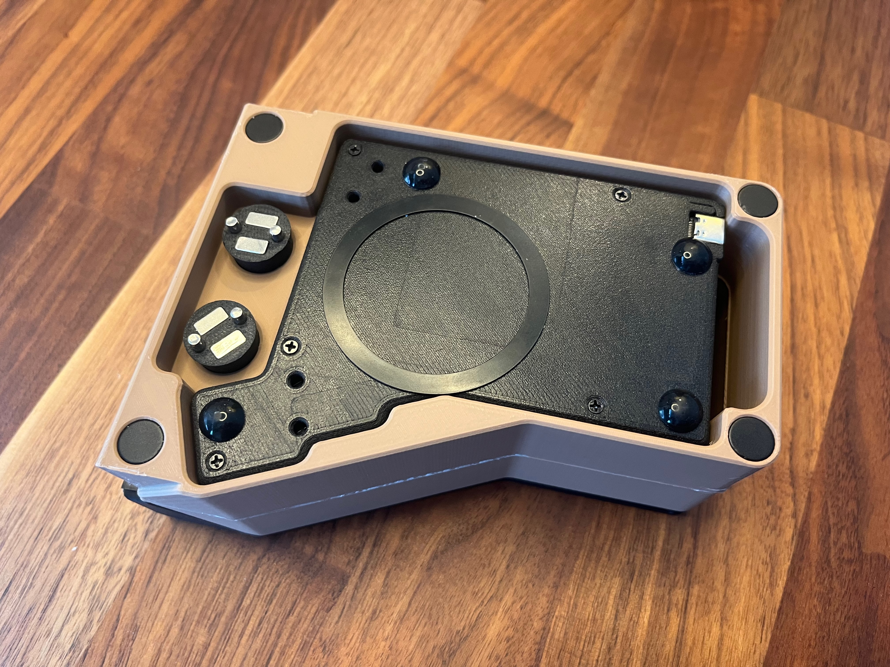
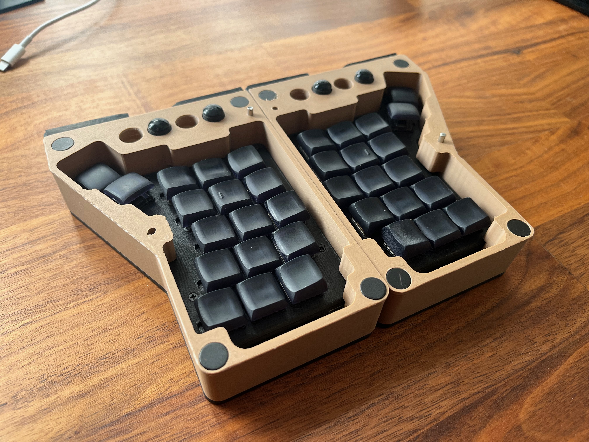

## 3D Print Everything
Files located in [model-files](/model-files). 

- Note that some might need to be flipped upside down in orientation for printing. The model files are taken from the assembly view, hence the assembly orientation.
- All 4 files should be printable without supports. Magnet holes have special geometry that don't require bridging nor support.
- I printed with 0.1 mm layer height for higher fidelity, but all the prototype prints I have done with 0.2 mm.

## Bill of Materials

See [README.md](README.md)

## Assembly

### Insert Magnets into the Case (Outer Side)
The spacing is designed for "press-fit", but you might want to add glue.

I suggest having magnets oriented in the same way.

Repeat for the second half.

### Insert Magnets into the Cover

Note: the magnet orientation relative to the case

Repeat for the second half.

### Insert Magnets and Pins into the Case (Inner Side)

- Pins are designed to be inserted into the half that has two round holes; it has tighter spacing.
- Note the magnet orientation, so both halves would actually connect!
- Because this is the side that was on the 3D printer bed, it may be a bit tight (depending on filament), so some instrument might be helpful to apply firm but gentle pressure.

### Rubber Stickers and Pads for Palm Rests
The cover has minor depressions of 10 mm in diameter to indicate where the stickers should go. The spacing is designed for pads at least 3.5 mm thick, so when the cover is angled, it still sits on the pads.

---

Next are rubber stickers that you need to cut out yourself. The design has about 5 mm spacing for friction stickers, so you have options. Although the solution in BoM worked out great for me.

Basically, you need 4 stripes that would provide friction when used as a palm rest. Note that the surface is angled to be flush with the table when standing.

### Put It All Together

